```{r setup, include=FALSE, warning=FALSE}
knitr::opts_chunk$set(echo = FALSE)
pacman::p_load(here, knitr, webshot)
```

#
```{r logo-dc, eval = TRUE}
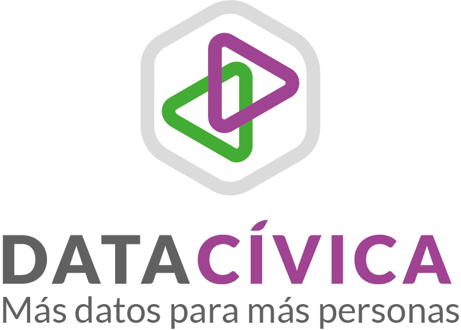

```

# ¿Por qué hablar de cuidados?
```{r distr-horas, eval = TRUE}
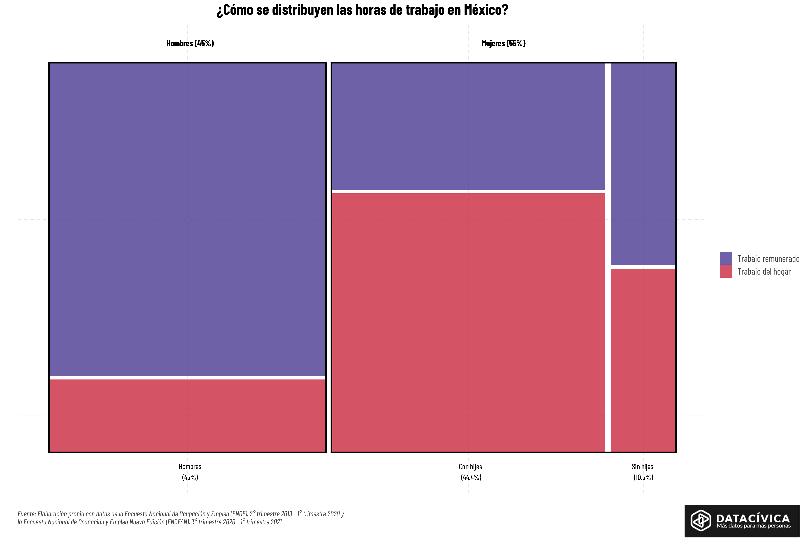
```

# ¿Por qué hablar de cuidados?
```{r particip, eval = TRUE}
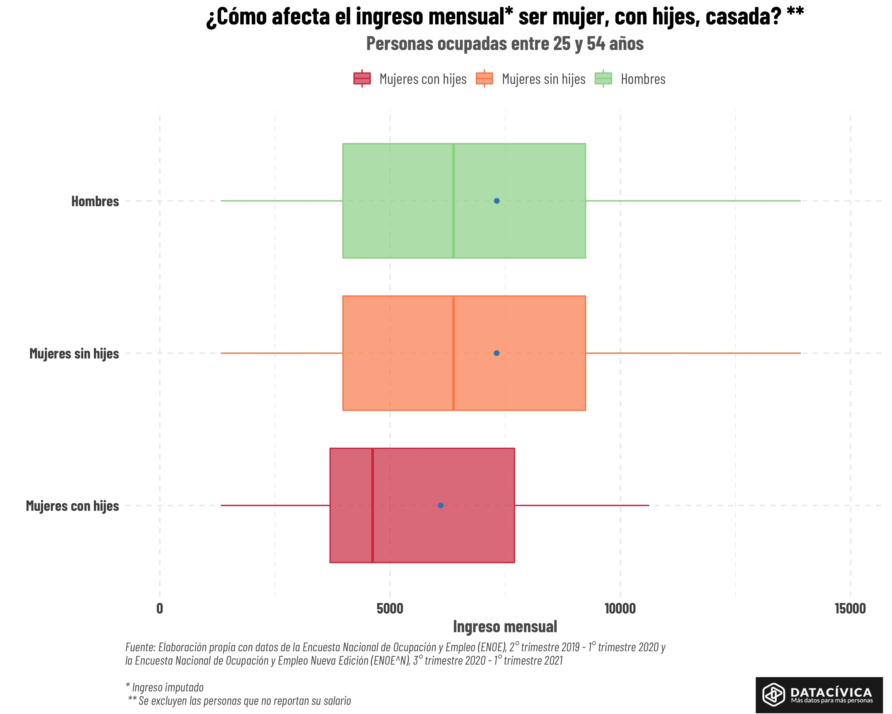
```

# ¿Cómo los transformamos en cambio?

Necesitamos **interpelar** al usuario:

- Acercándole la problemática
  - Personalizando el problema
  - "TU"
- Reconceptualizando la problemática para dimensionar su magnitud
- Resquematizando los agentes de cambio de la problemática
- Proviendo herramientas para convertir la indignación en acción

# ¿Por qué **Shiny**?
- Recursos limitados de parte del equipo de programación 
- Somos científicos sociales que utilizamos R de manera autodidácta

# **OBJETIVO:** ¿Cómo utilizar Shiny para generar herramientas que permitan no solo **sensibilizar** sino **tomar acción**?


# ¿Cómo **sensibilizar**? Narrativa: "Tu huella"
:::::: {.columns}
::: {.column}

```{r}

```
:::

::: {.column}
```{r}

```
:::
::::::

# ¿Cómo **sensibilizar**? Narrativa: Niveles del problema
```{r, out.width="100%", warning=FALSE}
library(cowplot)
library(ggplot2) 
library(gridExtra)

uno <- ggdraw() + draw_image("img/Progress_Bar1.svg")
dos <-ggdraw() + draw_image("img/Progress_Bar2.svg")
tres <- ggdraw() + draw_image("img/Progress_Bar3.svg")
cuatro <- ggdraw() + draw_image("img/Progress_Bar4.svg")
grid.arrange(uno, dos, tres, cuatro, ncol = 1, nrow = 4)


```

# ¿Cómo **sensibilizar**? Personalización del problema
:::::: {.columns}
::: {.column}
[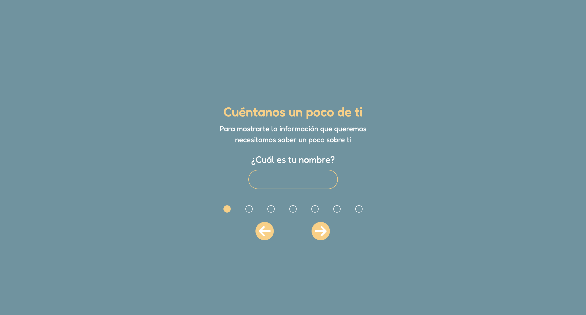](https://huelladecuidados.datacivica.org/#Ps-1)
:::

::: {.column}

```{r, echo = TRUE, eval = FALSE, size="tiny"}
mod_select_ui <- function(id) {
  ns <- NS(id)
  textInput(
    ns("nom"),
    "Pregunta",
    "Sin default")
}
```

:::
::::::

# ¿Cómo **sensibilizar**? Personalización del problema 
:::::: {.columns}
::: {.column}
```{r, echo = TRUE, eval = FALSE, size="tiny"}
mod_select_server <- function(id){
  moduleServer(id, 
               function(input, 
                        output, 
                        session){
    ns <- session$ns

    user_values <- list(
      name = reactive({ input$nom }),
      ...,
      sex = reactive({ input$sexo }))
    )

    return(user_values)
  })
}

```
:::
::: {.column}
```{r, echo = TRUE, eval = FALSE, size="tiny"}
app_server <- function(input, 
                       output, 
                       session) {
  
  input_values <- mod_select_server("user")
  enut_values <- mod_hrst_server("user",
                                        user_values = input_values,
                                        input_data = enut_data)

}

```
:::

::::::

# ¿Cómo **sensibilizar**? Posicionamiento del usuario con respecto al resto


[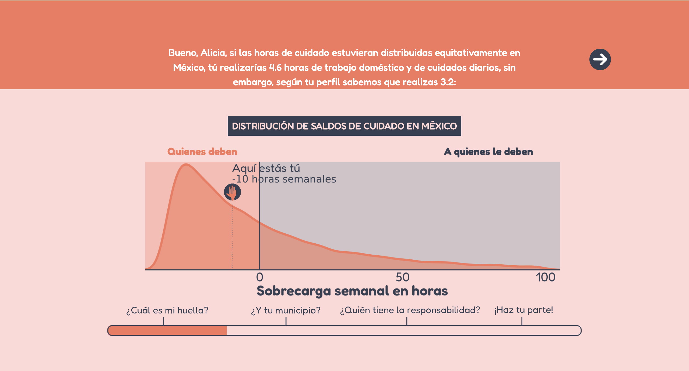](https://huelladecuidados.datacivica.org/#mi-huella-1)

# ¿Cómo **sensibilizar**? Posicionamiento del usuario con respecto al resto
:::::: {.columns}

::: {.column}
```{r echo = TRUE, eval = FALSE}
 mod_distribucion_server <- function(id, input_data, hrs_values) {
  moduleServer(id, function(input, output, session) {
    dist_cuidados <- reactive({...})
    output$distribucion <- renderPlot({dist_cuidados()})

  }
 }

mod_distribucion_ui <- function(id){
  plotOutput(outputId = ns("distribucion"))
}
```
:::
::: {.column}
```{r echo = TRUE, eval = FALSE}
dist_cuidados  <- reactive({
      sym.grob <- symbolsGrob(huella,
                              x=rescale(...),
                              y=rescale(...))

      ggplot() +
        geom_rect(...) +
        geom_density(
          data = input_data %>% filter(saldo <100),
          aes(x = saldo, weight = fac_per)) +
        ...
        geom_segment(aes(
          x = hrs_values()$saldo,
          xend = hrs_values()$saldo,
          y = 0,
          yend = ylim)) +
        annotation_custom(sym.grob)
})
```
:::
::::::


# ¿Cómo **sensibilizar**? Dimensionando la problemática de distintas formas
[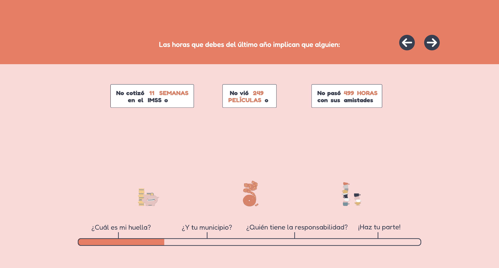](https://huelladecuidados.datacivica.org/#mi-huella-3)

# ¿Cómo **sensibilizar**? Rendición de cuentas a nivel local
[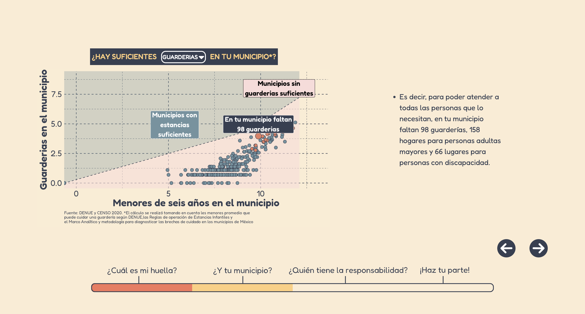](https://huelladecuidados.datacivica.org/#municipal-2)

# ¿Cómo habilitar la **toma de acción**?  
:::::: {.columns}
::: {.column}
- Envío de correos a legisladores en México para crear el Sistema Nacional de Cuidados. 
- Descarga de reportes con los resultados de las usuarias para concientizar sobre nuestra carga de cuidados en la sociedad y compartir en redes. 
:::
::: {.column}
[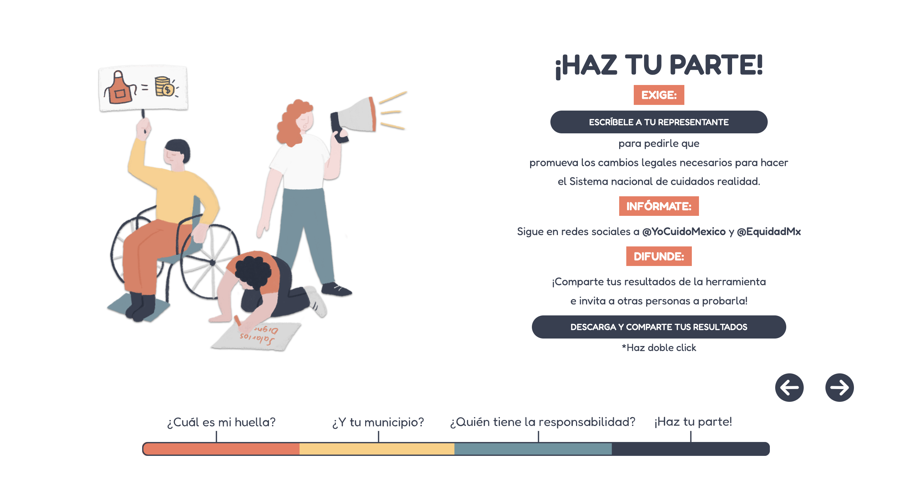](https://huelladecuidados.datacivica.org/#haz-parte)
:::
::::::

# ¿Cómo lo hicimos? 

## 1) Envío de correos 

- Creamos un módulo en Shiny donde se leen CSVs con correos de legisladores en México (diputadxs y senadorx)

- El módulo utiliza dos funciones desarrolladas por Data Cívica. La primera _r get_representative_emails_ carga los correos de los representantes y filtra por estados con base en la información ingresada por la usuaria. 

- La segunda función _mod_emails_details_server_ prepara el correo para enviar desde la aplicación con base en un template donde se incluyen datos y las exigencias puntuales del movimiento _#YoCuidoMéxico_ y la _#RedNacionalDeCuidados_

# ¿Qué aprendimos?

- Si el envío de correos depende de información ingresada previamente por las usuarias, existen ventajas en crear nuestro propio módulo y funciones para el envío de correos (Template y carga de bases de datos con contactos)

- Si los envíos de correos son sencillos podemos usar paquetes de R que solucionan esto como _mailtoR_. Actualmente estamos usando este paquete para una nueva app donde no tenemos que cargar listas de correos de personas. 


# Cómo lo hicimos 
## 2) Reportes con resultados de las usuarias 

- ¿Qué queríamos? 

- Queríamos que las usuarias pudieran descargar reportes con los resultados principales de su carga de cuidados. Es decir, su distribución de horas, las actividades que pueden o han dejado de hacer por su carga de cuidados y su contrafactual. 


¿Cuál era el reto principal? 

Queríamos generar infografías que se descargaran en formato PNG para que las usuarias puedan compartir sus carga de cuidados en redes sociales como _Twitter_ o _Instagram_

Por lo tanto... tuvimos que desarrollar nuestra propia forma de generar reportes en Shiny, ya que no podíamos usar reportes de Rmarkdown ya que éste no permite descargar en PNG. Además, necesitábamos más flexibilidad para expresiones reactive de Shiny. 


# ¿Cómo se generan los reportes de las usuarias? 

- Creamos un módulo donde se generan los tres reportes de resultados y se unen al final en un zip con los botones de descarga integrados en Shiny. 

- Unimos este módulo con los módulos donde se genera la gráfica de distribución y el contrafactual de la app. 

- Utilizamos _ggplot_, _ggtext_ y _cowplot_ para generar cada uno de los reportes. 


# ¿Cómo se generan los reportes de las usuarias? 
## Pasos: 

1. Con base en el resultado de las usuarias, guardamos las gráficas en un archivo temporal dentro de la app. 

2. Generamos ggplots donde se redactan los textos parametrizados con base en los resultados utilizando ggtext. 

3. Unimos este ggplot con las gráficas de distribución y el contrafactual. Además, generamos otro reporte con imágenes de las actividades que como leer libros, ir al cine o cotizar seguridad social.

4. Las usarias obtienen un archivo zip con los resultados principales en formato PNG que podrán compartir en redes o con familiares y personas cercanas. 


# Ejemplo 

```{r , echo=FALSE, out.width = '80%', fig.align='center'}
knitr::include_graphics(here("img/mi-reporte-1.png"))
```

# ¿Cuáles son los retos? 

- Generar estos reportes toma un poco de tiempo por las expresiones reactive y por la generación de imágenes en formato PNG junto con ggplot. 

- Además, es necesario modificar el botón original de desarcarga en Shiny para poder integrar nuestra propia clase en CSS. 

# ¿Cuáles son los retos? 

```{r, out.width = '70%'}
myDownloadButton <- function(outputId, 
                             label = "DESCARGA Y COMPARTE TUS RESULTADOS"){
  tags$a(id = outputId, 
         class = "download-results-button shiny-download-link", 
         href = "",
         target = "_blank", 
         download = NA, NULL, 
         label)
}
```
- Actualmente no hay un paquete en Shiny o R que permita generar estas infografías sin usar _Rmarkdown_.


## Jorge
Slides Giorgi

## Monse
Slides Monse

# ¿Cómo hacer un ggplot responsive?
:::::: {.columns}

::: {.column}
```{r}
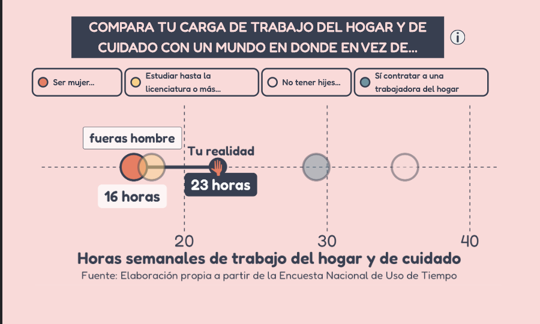
```
:::

:::{.column}
```{r}
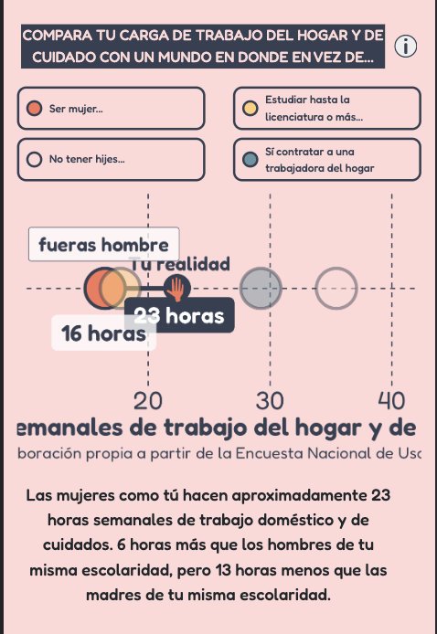
```
:::

::::::

# ¿Cómo hacer un ggplot responsive?
:::::: {.columns}

::: {.column}
```{r}
knitr::include_graphics("img/resp-lap.png")
```
:::

:::{.column}
```{r}
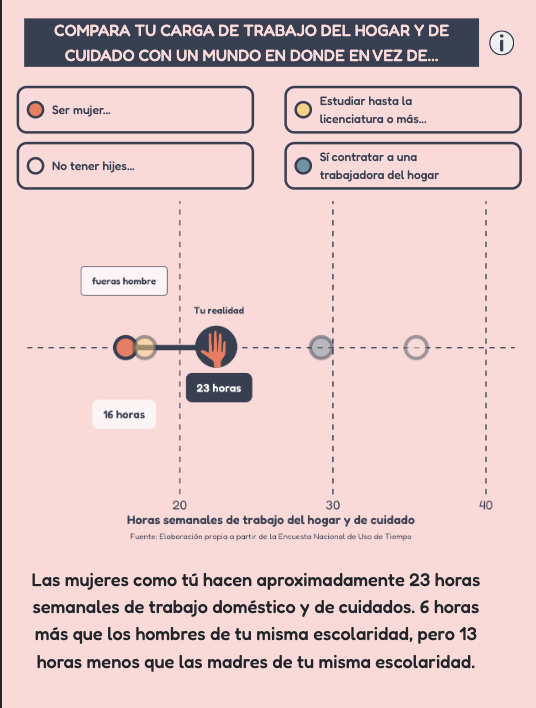
```
:::

::::::

# ¿Cómo hacer un ggplot responsive?
- Hacemos el tamaño de la fuente una **función del ancho del ggplot rendereado**
- ¿De donde sacamos el ancho del ggplot rendereado? `session$clientData`

# ¿Cómo hacer un ggplot responsive?
:::::: {.columns}

::: {.column}
```{r}
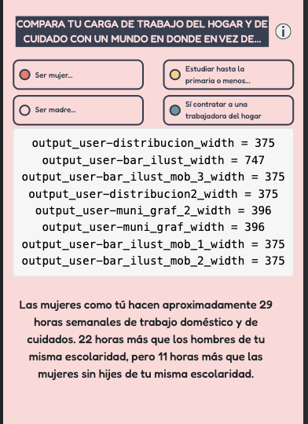
```
:::

:::{.column}
```{r}
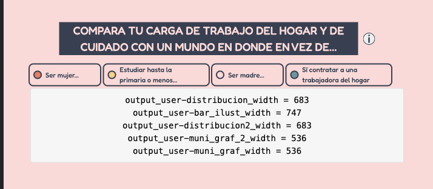
```
:::

::::::


# ¿Cómo hacer un ggplot responsive?
:::::: {.columns}
::: {.column}

```{r echo = TRUE, eval = FALSE}
    output$graf <- renderPlot({
      ggplot() +
        geom_text(
          size = 0.75*textFunction()
        ) 
      }, 
      height = plotHeight)
```
:::

:::{.column}
```{r echo = TRUE, eval = FALSE}
f <- 8
w <- reactive({
  session$clientData[["output_g_width"]]
})

textFunction <- function() {
  j <- ifelse(w > 425, 
              f, 
              0.45 * f)
  return(j)
}

plotHeight <- function() {
  h <- ifelse(w() > 425, 
              w() * 0.40, 
              w() * 0.70)
  return(h)
}
```
:::

::::::
# Limitaciones de Shiny como herramienta para la divulgación

- **Lenguaje de alto nivel**: más recursos 
- **Costo** de Shiny Server para ONG: Shiny proxy (más recursos)
- **Comunicación** con el equipo de programación (más recursos)

# Gracias
