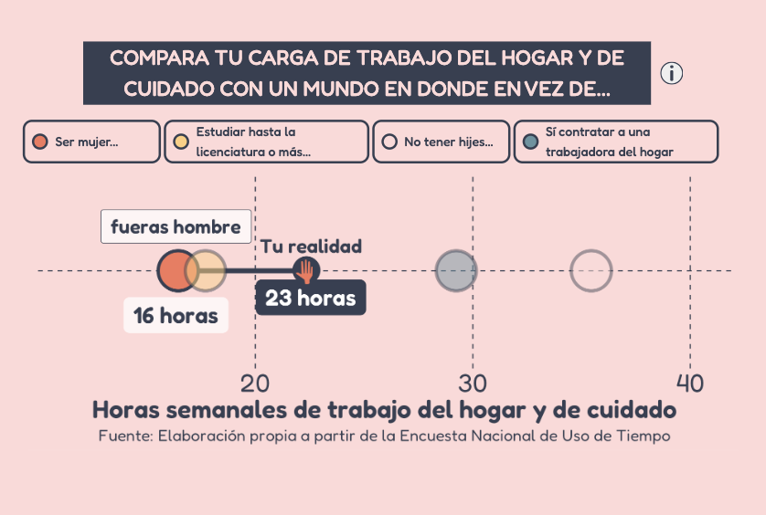

```{r setup, include=FALSE, warning=FALSE}
knitr::opts_chunk$set(echo = FALSE)
pacman::p_load(here, knitr, webshot)
```

## 
```{r logo-dc, eval = TRUE}
knitr::include_graphics("img/DC_logo_2017-01.png")

```

## ¿Por qué hablar de cuidados?
```{r distr-horas, eval = TRUE}

```

## ¿Por qué hablar de cuidados?
```{r particip, eval = TRUE}

```

## ¿Cómo los transformamos en cambio?

Necesitamos **interpelar** al usuario:

- Acercándole la problemática
  - Personalizando el problema
  - "TU"
- Reconceptualizando la problemática para dimensionar su magnitud
- Resquematizando los agentes de cambio de la problemática
- Proviendo herramientas para convertir la indignación en acción

## ¿Por qué **Shiny**?
- Recursos limitados de parte del equipo de programación 
- Somos científicos sociales que utilizamos R de manera autodidácta

## OBJETIVO: ¿Cómo utilizar Shiny para generar herramientas que permitan no solo **sensibilizar** sino **tomar acción**?


## ¿Cómo **sensibilizar**? Narrativa: "Tu huella"
:::::: {.columns}
::: {.column}

```{r}

```
:::

::: {.column}
```{r}

```
:::
::::::

## ¿Cómo **sensibilizar**? Narrativa: Niveles del problema
```{r, out.width="100%", warning=FALSE}
library(cowplot)
library(ggplot2) 
library(gridExtra)

uno <- ggdraw() + draw_image("img/Progress_Bar1.svg")
dos <-ggdraw() + draw_image("img/Progress_Bar2.svg")
tres <- ggdraw() + draw_image("img/Progress_Bar3.svg")
cuatro <- ggdraw() + draw_image("img/Progress_Bar4.svg")
grid.arrange(uno, dos, tres, cuatro, ncol = 1, nrow = 4)


```

## ¿Cómo **sensibilizar**? Personalización del problema
:::::: {.columns}
::: {.column}
[](https://huelladecuidados.datacivica.org/#Ps-1)
:::

::: {.column}
\tiny
```{r, echo = TRUE, eval = FALSE, size="tiny"}
mod_select_ui <- function(id) {
  ns <- NS(id)
  textInput(
    ns("nom"),
    "Pregunta",
    "Sin default")
}
```
\small
:::
::::::

## ¿Cómo **sensibilizar**? Personalización del problema 
:::::: {.columns}
::: {.column}
```{r, echo = TRUE, eval = FALSE, size="tiny"}
mod_select_server <- function(id){
  moduleServer(id, 
               function(input, 
                        output, 
                        session){
    ns <- session$ns

    user_values <- list(
      name = reactive({ input$nom }),
      ...,
      sex = reactive({ input$sexo }))
    )

    return(user_values)
  })
}

```
:::
::: {.column}
```{r, echo = TRUE, eval = FALSE, size="tiny"}
app_server <- function(input, 
                       output, 
                       session) {
  
  input_values <- mod_select_server("user")
  enut_values <- mod_hrst_server("user",
                                        user_values = input_values,
                                        input_data = enut_data)

}

```
:::

::::::

## ¿Cómo **sensibilizar**? Posicionamiento del usuario con respecto al resto


[](https://huelladecuidados.datacivica.org/#mi-huella-1)

## ¿Cómo *sensibilizar*? Posicionamiento del usuario con respecto al resto
:::::: {.columns}

::: {.column}
```{r echo = TRUE, eval = FALSE}
 mod_distribucion_server <- function(id, input_data, hrs_values) {
  moduleServer(id, function(input, output, session) {
    dist_cuidados <- reactive({...})
    output$distribucion <- renderPlot({dist_cuidados()})

  }
 }

mod_distribucion_ui <- function(id){
  plotOutput(outputId = ns("distribucion"))
}
```
:::

::: {.column}
```{r echo = TRUE, eval = FALSE}
dist_cuidados  <- reactive({
      sym.grob <- symbolsGrob(huella,
                              x=rescale(...),
                              y=rescale(...))

      ggplot() +
        geom_rect(...) +
        geom_density(
          data = input_data %>% filter(saldo <100),
          aes(x = saldo, weight = fac_per)) +
        ...
        geom_segment(aes(
          x = hrs_values()$saldo,
          xend = hrs_values()$saldo,
          y = 0,
          yend = ylim)) +
        annotation_custom(sym.grob)
})
```
:::
::::::


## ¿Cómo **sensibilizar**? Dimensionando la problemática de distintas formas
[](https://huelladecuidados.datacivica.org/#mi-huella-3)

## ¿Cómo **sensibilizar**? Rendición de cuentas a nivel local
[](https://huelladecuidados.datacivica.org/#municipal-2)

## ¿Cómo habilitar la **toma de acción**?  
[](https://huelladecuidados.datacivica.org/#haz-parte)

## Jorge
Slides Giorgi

## Monse
Slides Monse

## ¿Cómo hacer un ggplot responsive?
:::::: {.columns}

::: {.column}
```{r}

```
:::

:::{.column}
```{r}

```
:::

::::::

## ¿Cómo hacer un ggplot responsive?
:::::: {.columns}

::: {.column}
```{r}

```
:::

:::{.column}
```{r}
knitr::include_graphics("img/resp-mov.png")
```
:::

::::::

## ¿Cómo hacer un ggplot responsive?
- Hacemos el tamaño de la fuente una **función del ancho del ggplot rendereado**
- ¿De donde sacamos el ancho del ggplot rendereado? `session$clientData`

## ¿Cómo hacer un ggplot responsive?
:::::: {.columns}

::: {.column}
```{r}
knitr::include_graphics("img/movses.png")
```
:::

:::{.column}
```{r}
knitr::include_graphics("img/1024x800ses.png")
```
:::

::::::


## ¿Cómo hacer un ggplot responsive?
:::::: {.columns}
::: {.column}

```{r echo = TRUE, eval = FALSE}
    output$graf <- renderPlot({
      ggplot() +
        geom_text(
          size = 0.75*textFunction()
        ) 
      }, 
      height = plotHeight)
```
:::

:::{.column}
```{r echo = TRUE, eval = FALSE}
f <- 8
w <- reactive({
  session$clientData[["output_g_width"]]
})

textFunction <- function() {
  j <- ifelse(w > 425, 
              f, 
              0.45 * f)
  return(j)
}

plotHeight <- function() {
  h <- ifelse(w() > 425, 
              w() * 0.40, 
              w() * 0.70)
  return(h)
}
```
:::

::::::
## Limitaciones de Shiny como herramienta para la divulgación

- **Lenguaje de alto nivel**: más recursos 
- **Costo** de Shiny Server para ONG: Shiny proxy (más recursos)
- **Comunicación** con el equipo de programación (más recursos)

## Gracias
